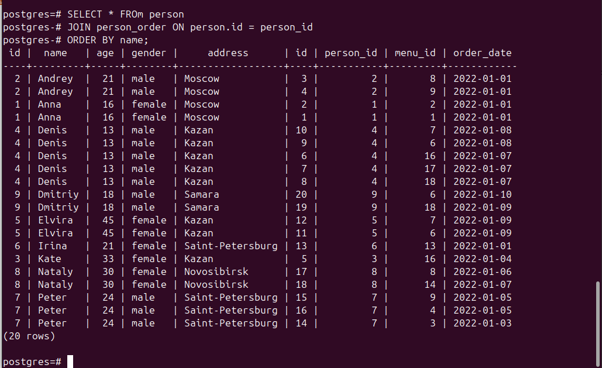

#     INSTALL PostgreSQL                                                             
 https://selectel.ru/blog/tutorials/how-to-install-and-use-postgresql-on-ubuntu-20-04/ 

```bash
printf '\n\t\t\t\033[00;34m <<< 
Загрузятся драйверы PostgreSQL последней версии и развернутся необходимые компоненты на Ubuntu.
 >>>\n\t\t '
sudo apt update 					# До загрузки PostgreSQL обновляем списки пакетов
sudo apt install postgresql postgresql-contrib          # Загрузим PostgreSQL с утилитой -contrib:   
sudo systemctl start postgresql.service 		# Запускаем сервис
sudo systemctl status postgresql.service 		# Проверка статуса сервиса: 
``` 

 Сервис развернули, теперь разберемся в работе аккаунта Postgres.
 Войдем в аккаунт Postgres с sudo. Если сейчас находимся в аккаунте Postgres, нужно выйти, набрав exit. В этом варианте перейдем в аккаунт Postgres с sudo:
`$ sudo -u postgres psql`

 Возврат в аккаунт: ` $ postgres=# \q`

`\dt`  - look at table 
`\db`  - show all table
`\d` name_tabel - look as shema table

`\i` 'model.sql'  - execute scripts
`\q` - exit



