# SQL Bootcamp 

<details>
<summary>  Preamble  </summary>

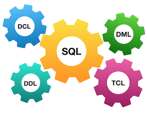

Standards are everywhere, and Relational Databases are also under control as well :-). To be honest between us, more restricted SQL standards were at the beginning of 2000 years. Actually when the “Big Data” pattern was born, Relational Databases had their own way to realize this pattern and therefore standards are more... lightweight right now. 

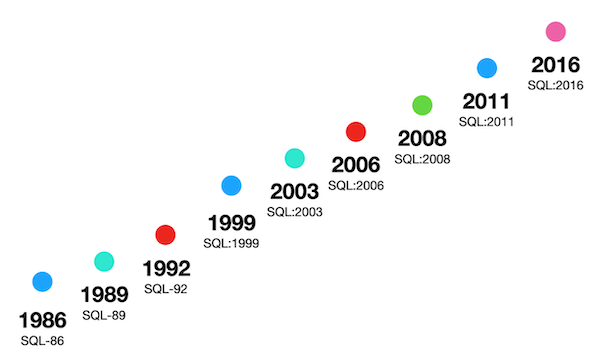

Please take a look at some SQL standards below and try to think about the future of Relational Databases.

|  |  |
| ------ | ------ |
| 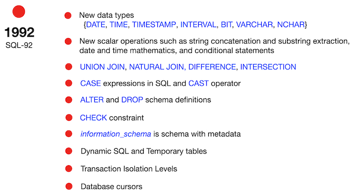 | 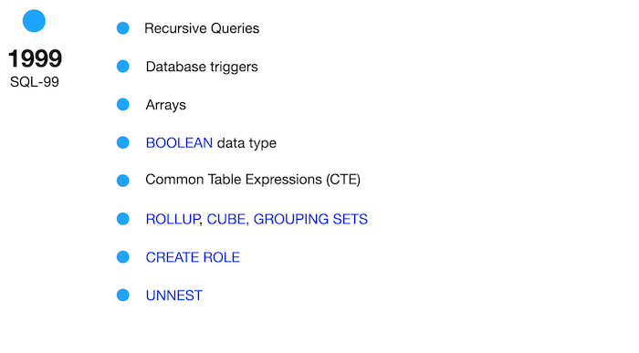 |
| 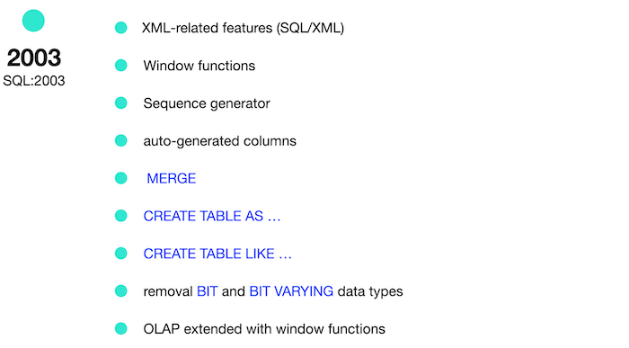 | 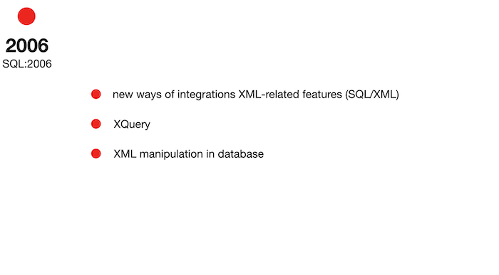 |
| 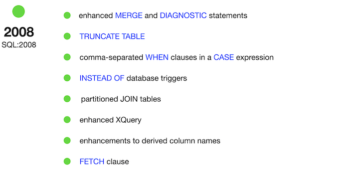 | 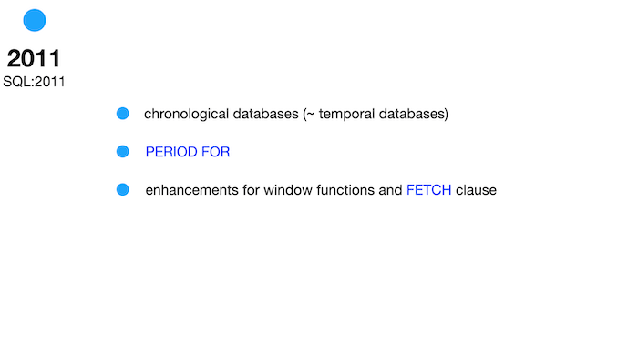 |


</details>

<details>
<summary> General Rules </summary>

- Убедись что используешь последнюю версию PostgreSQL (Make sure you are using the latest version of PostgreSQL.)
- Use this page as the only reference. Do not listen to any rumors and speculations on how to prepare your solution.
- That is completely OK if you are using IDE to write a source code (aka SQL script).
- To be assessed your solution must be in your GIT repository.
- Your solutions will be evaluated by your piscine mates.
- You should not leave in your directory any other file than those explicitly specified by the exercise instructions. It is recommended that you modify your `.gitignore` to avoid accidents.
- Do you have a question? Ask your neighbor on the right. Otherwise, try with your neighbor on the left.
- Your reference manual: mates / Internet / Google. 
- Read the examples carefully. They may require things that are not otherwise specified in the subject.
- And may the SQL-Force be with you!
- Absolutely everything can be presented in SQL! Let’s start and have fun!


</details>

</details>


<details>
<summary>## Rules of the day</summary> 


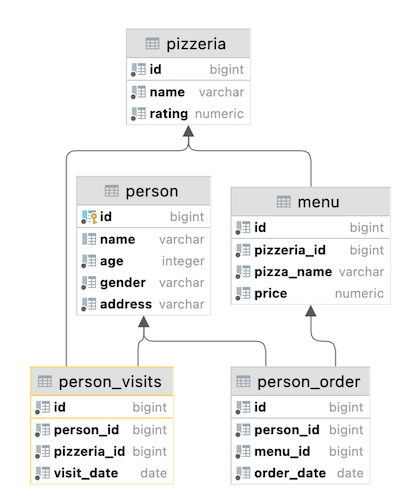

</details>

<details>
<summary> Rules of the day </summary>

 Please make sure you have an own(собственный) database and access to it on your PostgreSQL cluster.
- Please download a [script](model.sql) with Database Model here and apply the script to your database (you can use command line with psql or just run it through any IDE, for example DataGrip from JetBrains or pgAdmin from PostgreSQL community). 
- All tasks contain a list of Allowed and Denied sections with listed database options, database types, SQL constructions etc. Please have a look at the section before you start.
- посмотрите логическое представление модели базы данных ниже 


1. **pizzeria** table (Dictionary Table with available pizzerias)
- field **id** — primary key 
- field **name** — название пиццерии  
- field **rating** — average(средний) рейтинг пицерии (от 0 до 5)
2. **person** table (Dictionary Table with persons who loves pizza)
- field **id** — primary key
- field **name** — Имя  
- field **age** — возраст  
- field **gender** — пол  
- field **address** — адресс  
3. **menu** table (Dictionary Table with available menu and price for concrete pizza)
- field id — primary key
- field pizzeria_id — foreign key to pizzeria
- field pizza_name — name of pizza in pizzeria
- field price — price of concrete pizza
4. **person_visits** table (Operational Table with information about visits of pizzeria)
- field id — primary key
- field person_id — foreign key to person
- field pizzeria_id — foreign key to pizzeria
- field visit_date — date (for example 2022-01-01) of person visit 
5. **person_order** table (Operational Table with information about persons orders)
- field id — primary key
- field person_id — foreign key to person
- field menu_id — foreign key to menu
- field order_date — date (for example 2022-01-01) of person order 

People's visit(посещения) and people's order(заказы) are different entities and don't contain any correlation between data. 
>в заданиях клиенты могут быть в одном ресторане (только посмотреть меню) и в это время делать заказ в другом по телефону или из мобильного приложения.
Or another case,  just be at home and again make a call with order without any visits.
</details>

<details>
	
<summary> day 00 - базовые конструкции SQL.  </summary>

[]  **Упражение 00:**  Создать выбоку через `SELECT` в которой будет имена и возраст всех кто живет в городе Казань.  
[]  **Упражение 01:** Через оператор `SELECT`  который должен вернуть names, ages всех женщин из города ‘Kazan’. Результат должен быть **отсортирован** по имени.  
[]  **Упражение 02:**
Please make 2 syntax different `SELECT` запроса которые вернет список из таблицы `pizzeria` (pizzeria name and rating) с рейтингом от 3.5 до 5 (включительно) и **отсортировать результат** по рейтингу.
- the 1st `SELECT` должен бытть основан на неравенствах  (<=, >=);
- the 2nd `SELECT` с ключевым словом `BETWEEN`.  

[]  **Упражение 03:**
Please make a `SELECT` запрос который возвращает the person identifiers (без дублей) тех кто посетил пиццерию в период с 6 января 2022 по 9 января 2022 (включительно) или посетил пиццерию с индетификатором 2. Also включите сортировку clause by person identifier in **descending** mode(по убыванию).  

[] **Упражение 04:** 
Please make a `SELECT` запрос который вернет одно вычисленное поле которые называется   ‘person_information’ in one string like described (описываемый) in the next sample:

`Anna (age:16,gender:'female',address:'Moscow')`

Finally, please add the ordering clause by calculated column in **ascending** mode.
Please pay attention to the **quotation** marks in your formula! (обратите внимание на то что в формуле должны быть кавычки)  

[] **Упражнение 05:** 
Напиши селект запрос который вернет имена людей () которые сделали заказ из меню с идентификаторами 13, 14 и 18, дата заказа должна быть 7 января 2022 года. 
Write a `SELECT` statement that returns the names of people (based on an internal query in the ``SELECT`` clause) who placed orders for the menu with identifiers 13, 14, and 18, and the date of the orders should be January 7, 2022. Be careful with "Denied Section"(запрещенный раздел) before your work.

Please take a look at the pattern of internal query.

    `SELECT` 
	    (`SELECT` ... ) AS NAME  -- this is an internal query in a main `SELECT` clause
    FROM ...
    WHERE ...
    

**Упражение 06:** 
Используя SQL-конструкцию из упражениия 05 и добавь новый вычисляемый столбец (назови его ‘check_name’) проверяющий запрос в пвсевдокоде в предложении ``SELECT``   
Use the SQL construction from Exercise 05 and add a new calculated column (use column name ‘check_name’) with a check statement a pseudocode for this check is given below(ниже)) in the ``SELECT`` clause(предложении).

    if (person_name == 'Denis') then return true
        else return false

**Управжнение 07:** 
Let's apply data intervals to the `person` table.  
((*apply*)применение интервалов к таблице `person`  )
Please make an SQL statement that returns the identifiers of a person, the person's names, and the interval of the person's ages (set a name of a new calculated column as 'interval_info') based on the pseudo code below(базовый псевдокод представлен ниже).


    if (age >= 10 and age <= 20) then return 'interval #1'
    else if (age > 20 and age < 24) then return 'interval #2'
    else return 'interval #3'

And yes... please sort a result by ‘interval_info’ column in ascending mode.
И да... пожалуйтса отсортируй результат по столбцу ‘interval_info’ по возрастанию

**Упражение 08:** 
Create an SQL statement that returns all columns from the `person_order` table with rows whose identifier is an even number. The result must be ordered by the returned identifier.  

Создать запрос который вернет все столбцы из таблицы `person_order` в чьих строках identifier это четное число.  Рузультат должен быть отсортирован по возрвращаемуму идентификатору

| Exercise 09:

Please make a `SELECT` statement that returns person names and pizzeria names based on the `person_visits` table with a visit date in a period from January 07 to January 09, 2022 (including all days) (based on an internal(внутренний) query in the `FROM' clause (предложении)).

Пожалуйста сделайте `SELECT` запрос который вернет имена и названия пиццерий из таблицы `person_visits` где дата визита была в период с 7 января по 9 января 2022(включая эти дни) (основной  внутренний запрос в предложении `FROM')

Please take a look at the pattern of the final query.

```
    `SELECT` (...) AS person_name ,  -- this is an internal query in a main `SELECT` clause
            (...) AS pizzeria_name  -- this is an internal query in a main `SELECT` clause
    FROM (`SELECT` … FROM person_visits WHERE …) AS pv -- this is an internal query in a main FROM clause
    ORDER BY ...
```

Please add a **ordering** clause by person name in ascending mode and by pizzeria name in descending mode.

</details>

[D00_ex00](src/day00.sql)

<details>
	
<summary> day 01 - UNION  </summary>

<details>
<summary> Введение </summary> 


In many aspects, sets are used in Relational Databases. Not just, make UNION or find MINUS between sets. Sets are also good candidates to make recursive queries.  
>(Во многих аспектах, множества используются в реляционных базах данных. Не только для объединения или поиска отрицательных значений между множествами. Множества также хороши для выполнения рекурсивных запросов)

There are the next set operators in PostgreSQL. 
- UNION [ALL]
- EXCEPT [ALL] 
- INTERSECT [ALL]
 
> ключевое слово “ALL” выведет в результат строки с дублями  
основные правила для работы с множествами :
- The main SQL provides a final names of attributes for whole query
> 
- The attributes of controlled SQL should satisfied number of columns and corresponding family types of main SQL


Moreover, SQL sets are useful  to calculate some specific Data Science metrics, for example Jaccard distance between 2 objects based on existing data features.

</details>


<details>
<summary>Exercise 00: Let’s make UNION dance  </summary> 
  
| Exercise 00: Let’s make UNION dance |                                                                                                                          |
|---------------------------------------|--------------------------------------------------------------------------------------------------------------------------|
| Turn-in directory                     | ex00                                                                                                                     |
| Files to turn-in                      | `day01_ex00.sql`                                                                                 |
| **Allowed**                               |                                                                                                                          |
| Language                        | ANSI SQL                                                                                              |


(Напишите SQL запрос который вернет id меню и название пицы из таблицы `menu` и id человека и его имя из таблицы `person` в одном списке вывода (с названием столбцов как показано ниже) отсортируйте сначала по object_id а затем по object_name

| object_id | object_name |
| ------ | ------ |
| 1 | Anna |
| 1 | cheese pizza |
| ... | ... |

</details>

<details>
<summary> Exercise 01: UNION dance with subquery</summary> 

| Exercise 01: UNION dance with subquery|                                                                                                                          |
|---------------------------------------|--------------------------------------------------------------------------------------------------------------------------|
| Turn-in directory                     | ex01                                                                                                                     |
| Files to turn-in                      | `day01_ex01.sql`                                                                                 |
| **Allowed**                               |                                                                                                                          |
| Language                        | ANSI SQL                                                                                              |

Please modify a SQL statement from “exercise 00” by removing the object_id column. Then change ordering by object_name for part of data from the `person` table and then from `menu` table (like presented on a sample below). Please save duplicates!  

(Измените SQL запрос из прошлого упражнения уберите столбец object_id. Затем измените сортировку по object_name сначало сортируйте значения из таблицы  `person` и затем только из таблицы `menu`(как поаказано ниже). Записи могут дублироваться!

| object_name |
| ------ |
| Andrey |
| Anna |
| ... |
| cheese pizza |
| cheese pizza |
| ... |


</details>

<details>
<summary> Exercise 02: Duplicates or not duplicates</summary> 

| Exercise 02: Duplicates or not duplicates|                                                                                                                          |
|---------------------------------------|--------------------------------------------------------------------------------------------------------------------------|
| Turn-in directory                     | ex02                                                                                                                     |
| Files to turn-in                      | `day01_ex02.sql`                                                                                 |
| **Allowed**                               |                                                                                                                          |
| Language                        | ANSI SQL                                                                                              |
| **Denied**                               |                                                                                                                          |
| SQL Syntax Construction                        | `DISTINCT`, `GROUP BY`, `HAVING`, any type of `JOINs`                                                                                              |

Please write a SQL statement which returns unique pizza names from the `menu` table and orders by pizza_name column in descending mode. Please pay attention to the Denied section.  

(напишите SQL запрос который возвращает только уникальные названия пицц из таблицы `menu` и сортирует по названию пицц в убывающем порядке. обратите внимание некоторые конструкции запрещены )

</details>

<details>
<summary> Exercise 03 - “Hidden” Insights</summary> 


| Exercise 03: “Hidden” Insights |                                                                                                                          |
|---------------------------------------|--------------------------------------------------------------------------------------------------------------------------|
| Turn-in directory                     | ex03                                                                                                                     |
| Files to turn-in                      | `day01_ex03.sql`                                                                                 |
| **Allowed**                               |                                                                                                                          |
| Language                        | ANSI SQL                                                                                              |
| **Denied**                               |                                                                                                                          |
| SQL Syntax Construction                        |  any type of `JOINs`                                                                                              |

Please write a SQL statement which returns common rows for attributes order_date, person_id from `person_order` table from one side and visit_date, person_id from `person_visits` table from the other side (please see a sample below). In other words, let’s find identifiers of persons, who visited and ordered some pizza on the same day. Actually, please add ordering by action_date in ascending mode and then by person_id in descending mode.  
который возвращает строки из атрибутов даты заказа, персон_ид из таблицы `person_order` с одной стороны и дата визита из `person_visits` таблицы из сдругой стороны (пожалуйста смотрите пример ниже). в других словах, давай найдем идентификаторы людей, кто посещал и заказывал 

| action_date | person_id |
| ------ | ------ |
| 2022-01-01 | 6 |
| 2022-01-01 | 2 |
| 2022-01-01 | 1 |
| 2022-01-03 | 7 |
| 2022-01-04 | 3 |
| ... | ... |

</details>

<details>
<summary> Exercise 04: Difference? Yep, let's find the difference between multisets.</summary> 


| Exercise 04: Difference? Yep, let's find the difference between multisets. |                                                                                                                          |
|---------------------------------------|--------------------------------------------------------------------------------------------------------------------------|
| Turn-in directory                     | ex04                                                                                                                     |
| Files to turn-in                      | `day01_ex04.sql`                                                                                 |
| **Allowed**                               |                                                                                                                          |
| Language                        | ANSI SQL                                                                                              |
| **Denied**                               |                                                                                                                          |
| SQL Syntax Construction                        |  any type of `JOINs`                                                                                              |

Please write a SQL statement which returns a difference (minus) of person_id column values with saving duplicates between `person_order` table and `person_visits` table for order_date and visit_date are for 7th of January of 2022  
> вернуть разницу значения столбца  person_id с дублями  между  `person_order` и  `person_visits` таблицами дата заказа и дата визита 7  января 2022  

</details>

<details>
<summary>Exercise 05 - Did you hear about Cartesian Product? (Вы слышали о Декартовом произведении)</summary> 


| Exercise 05: Декартово произведение |                                                                                                                          |
|---------------------------------------|--------------------------------------------------------------------------------------------------------------------------|
| Turn-in directory                     | ex05                                                                                                                     |
| Files to turn-in                      | `day01_ex05.sql`                                                                                 |
| **Allowed**                               |                                                                                                                          |
| Language                        | ANSI SQL                                                                                              |

Please write a SQL statement which returns all possible combinations between `person` and `pizzeria` tables and please set ordering by person identifier and then by pizzeria identifier columns. Please take a look at the result sample below. Please be aware column's names can be different for you.  
> вернуть все возможные комбинации между таблицами `person` и `pizzeria` и отсортируйте по идентификатору персоны и затем по идентификатору пиццерии. посмотрите на пример результата ниже. Ознакомьтесь с названиями столбцов 

| person.id | person.name | age | gender | address | pizzeria.id | pizzeria.name | rating |
| ------ | ------ | ------ | ------ | ------ | ------ | ------ | ------ |
| 1 | Anna | 16 | female | Moscow | 1 | Pizza Hut | 4.6 |
| 1 | Anna | 16 | female | Moscow | 2 | Dominos | 4.3 |
| ... | ... | ... | ... | ... | ... | ... | ... |


</details>

<details>
<summary> Exercise 06 - Lets see on “Hidden” Insights</summary> 

| Exercise 06: Lets see on “Hidden” Insights |                                                                                                                          |
|---------------------------------------|--------------------------------------------------------------------------------------------------------------------------|
| Turn-in directory                     | ex06                                                                                                                     |
| Files to turn-in                      | `day01_ex06.sql`                                                                                 |
| **Allowed**                               |                                                                                                                          |
| Language                        | ANSI SQL                                                                                              |

Let's return our mind back to exercise #03 and change our SQL statement to return person names instead(вместо) of person identifiers and change ordering by action_date in ascending(возрастающем) mode and then by person_name in descending mode. Please take a look at a data sample below.

> Давай вернемся к нашему решению из упражнения #03 и изменим запрос так что бы он возвращал имена вместо идентификаторов персон и изменим сортирувоку по action_date в возрастающем порядке а затем по именам в убывающем порядке. посмотри на данные из примера ниже.  


| action_date | person_name |
| ------ | ------ |
| 2022-01-01 | Irina |
| 2022-01-01 | Anna |
| 2022-01-01 | Andrey |
| ... | ... |


</details>


| Exercise 08: Migrate JOIN to NATURAL JOIN |                                                                                                                          |
|---------------------------------------|--------------------------------------------------------------------------------------------------------------------------|
| Описание                   | NATURAL JOIN (естественное соединение) — это тип соединения в SQL, который автоматически объединяет таблицы на основе столбцов с одинаковыми именами и совместимыми типами данных                                                                                                                  |
| Как работает                    | Идентифицирует все столбцы, которые есть в обеих таблицах и имеют одинаковые имена и типы данных Для каждой такой пары выполняет проверку на равенство значений. В результирующей таблице каждый из этих общих столбцов появляется только один раз (дубликаты имён устраняются).                                                                                 |
| Опасность 1                               |   Неявность — это риск. Главная опасность NATURAL JOIN в том, что он сопоставляет столбцы только по имени, а не по смыслу (например, если в обеих таблицах есть столбец id, это не значит, что их нужно объединять                                                                                                                       |
| Опасность 2                        |Изменение схемы ломает запрос. Если позже в одну из таблиц добавят новый столбец с именем, которое уже есть в другой таблице, NATURAL JOIN начнёт соединять и этот новый столбец, даже если он не имеет отношения к задаче                                                                                          |
| Опасность 3                        |Не все СУБД поддерживают. Например, SQL Server не поддерживает синтаксис NATURAL JOIN                                                                                              |
| Когда использовать                             |   Я рекомендую прибегать к NATURAL JOIN только в очень специфических, хорошо продуманных сценариях, когда вы абсолютно уверены, что столбцы с одинаковыми именами действительно логически связаны (например, это первичные и внешние ключи в чётко спроектированной схеме)                                                                                                                       |
| SQL Syntax Construction                        |                                                                                        |
 ```sql
      SELECT order_date,
              person_information 
         FROM person_order
 NATURAL JOIN (SELECT id AS person_id,
                      CONCAT(person.NAME, ' (age:', person.age, ')') AS  person_information 
                 FROM person)
 ORDER BY 1,2
```  


[D01_задания](src/day01.sql)

</details>

<details>
	
<summary> day 02 -Глубокое погружение в JOIN.  </summary>

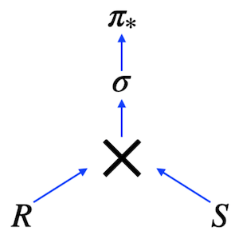

In the picture, you can see a Relational Expression in Tree View. This expression corresponds the next SQL query 

    SELECT *
        FROM R CROSS JOIN S
    WHERE clause

So, in other words we can describe any SQL in mathematical terms of Relational Algebra.

The main question (which I hear from my students) is why do we need to learn Relational Algebra in a course, if we can write a SQL in a first attempt? My answer is yes and no in one time. “Yes” means you can write a SQL from the first attempt, that’s right , “No” means you have to know the main aspects of Relational Algebra, because this knowledge is in use for optimization plans and for semantic queries. 
Which type of joins are existing in Relational Algebra?
Actually, “Cross Join” is a primitive operator and it is an ancestor for other types of joins.
- Natural Join
- Theta Join
- Semi Join
- Anti Join
- Left / Right / Full Joins 

But what does a join operation between 2 tables mean? Let me present a part of pseudo code, how join operation works without indexing. 

```sql
    FOR r in R LOOP
        FOR s in S LOOP
        if r.id = s.r_id then add(r,s)
        …
        END;
    END;
```
Это просто множество циклов ... Никакой магии


| Упражение 00: |       [D02_Exercise](src/day02.sql)   |
| ------ | ------ |
| **Упражение 01:** | **вернуть потерянные даты с 1 по 10  января 2022 (включительно) посещений с идентификатором 1 или 2 (это значит дней дней утеряно оба) отсортируйте дни посещений по возрастанию. Пример с названием поля ниже.**|
|--- |   использовать конструкцию `generate_series(...)` |
|--- |  [Нельзя использовать `NOT IN`, `IN`, `NOT EXISTS`, `EXISTS`, `UNION`, `EXCEPT`, `INTERSECT`]                                                                                              |
|--- |  |
|**Упражение 02:** | **вернуть весь список имен посетителей( или не посетителей) пиццерий за период с 1 по 3 января 2022 с одной стороны и весь список названий пиццерий который имеет и не имет посетителй с другой стороны. Пример с нужными названими колонок представлен ниже. Обратите внимание на замену ‘-’ for `NULL` значений в столбцах.**|
|--- |  [Нельзя использовать  `NOT IN`, `IN`, `NOT EXISTS`, `EXISTS`, `UNION`, `EXCEPT`, `INTERSECT`]                                                                                              |
| **Упражение 03** | **вернемся к упраженению 1 перепешите SQL-запрос с использованием СТЕ паттерна. перемести в часть СТЕ ваш "генератор дней". Вывод должен быть таким же как в упражнениии 1** |
|--- |   использовать конструкцию `generate_series(...)` |
|--- |  [Нельзя использовать  `NOT IN`, `IN`, `NOT EXISTS`, `EXISTS`, `UNION`, `EXCEPT`, `INTERSECT`]    

Пример результата упражнения 01
| missing_date |
| ------ |
| 2022-01-03 |
| 2022-01-04 |
| 2022-01-05 |
| ... | 

Пример результата упражнения 02
| person_name | visit_date | pizzeria_name |
| ------ | ------ | ------ |
| - | null | DinoPizza |
| - | null | DoDo Pizza |
| Andrey | 2022-01-01 | Dominos |
| Andrey | 2022-01-02 | Pizza Hut |
| Anna | 2022-01-01 | Pizza Hut |
| Denis | null | - |
| Dmitriy | null | - |
| ... | ... | ... |


[ ] **Упражение 04**:
Find full information about all possible pizzeria names and prices to get mushroom or pepperoni pizzas. Please sort the result by pizza name and pizzeria name then. The result of sample data is below (please use the same column names in your SQL statement).

| pizza_name | pizzeria_name | price |
| ------ | ------ | ------ |
| mushroom pizza | Dominos | 1100 |
| mushroom pizza | Papa Johns | 950 |
| pepperoni pizza | Best Pizza | 800 |
| ... | ... | ... |

[ ] **Упражение 05**:                                                                                     |

Find names of all female persons older than 25 and order the result by name. The sample of output is presented below.

| name | 
| ------ | 
| Elvira | 
| ... |

[ ] **Упражение 06**:
Please find all pizza names (and corresponding pizzeria names using `menu` table) that Denis or Anna ordered. Sort a result by both columns. The sample of output is presented below.

| pizza_name | pizzeria_name |
| ------ | ------ |
| cheese pizza | Best Pizza |
| cheese pizza | Pizza Hut |
| ... | ... |

[ ] **Упражение 07**:
Please find the name of pizzeria Dmitriy visited on January 8, 2022 and could eat pizza for less than 800 rubles.

[ ] **Упражение 08**: Please find the names of all males from Moscow or Samara cities who orders either pepperoni or mushroom pizzas (or both) . Please order the result by person name in descending mode. The sample of output is presented below.

| name | 
| ------ | 
| Dmitriy | 
| ... |

[ ] **Упражение 09**: Please find the names of all females who ordered both pepperoni and cheese pizzas (at any time and in any pizzerias). Make sure that the result is ordered by person name. The sample of data is presented below.

| name | 
| ------ | 
| Anna | 
| ... |

[ ] **Упражение 10**: Найти всех людей, которые живут по одному адресу. Результат должен быть отсортирован по имени первого человека, затем по имени второго человека  и затем по адресу. Пример ниже , названия столбцов должны быть такие же как ниже в примере

| person_name1 | person_name2 | common_address | 
| ------ | ------ | ------ |
| Andrey | Anna | Moscow |
| Denis | Kate | Kazan |
| Elvira | Denis | Kazan |
| ... | ... | ... |

</details>


# Day 03 - Piscine SQL

## _Continuing to JOIN and make change in data_

Resume: Today you will see how to change data based on DML language

<details>
<summary>Contents</summary>
1. [Chapter I](#chapter-i) \[Preamble](#preamble)
2. [Chapter II](#chapter-ii) \ [General Rules](#general-rules)
3. [Chapter III](#chapter-iii) \ [Rules of the day](#rules-of-the-day)  
4. [Chapter IV](#chapter-iv) [Exercise 00 - Let’s find appropriate prices for Kate](#exercise-00-lets-find-appropriate-prices-for-kate)  
[Exercise 01 - Let’s find forgotten menus](#exercise-01-lets-find-forgotten-menus)  
 [Exercise 02 - Let’s find forgotten pizza and pizzerias](#exercise-02-lets-find-forgotten-pizza-and-pizzerias)  
 [Exercise 03 - Let’s compare visits](#exercise-03-lets-compare-visits)  
[Exercise 04 - Let’s compare orders](#exercise-04-lets-compare-orders)
[Exercise 05 - Visited but did not make any order (*Посетили но не сделали ни один заказ*)](#exercise-05-visited-but-did-not-make-any-order)
[Exercise 06 - Find price-similarity pizzas](#exercise-06-find-price-similarity-pizzas)
[Exercise 07 - Let’s cook a new type of pizza](#exercise-07-lets-cook-a-new-type-of-pizza)
[Exercise 08 - Let’s cook a new type of pizza with more dynamics](#exercise-08-lets-cook-a-new-type-of-pizza-with-more-dynamics)
[Exercise 09 - New pizza means new visits](#exercise-09-new-pizza-means-new-visits)
[Exercise 10 - New visits means new orders](#exercise-10-new-visits-means-new-orders)
15. [Chapter XV](#chapter-xv) \ [Exercise 11 - “Improve” a price for clients](#exercise-11-improve-a-price-for-clients)    
16. [Chapter XVI](#chapter-xvi) \[Exercise 12 - New orders are coming!](#exercise-12-new-orders-are-coming)
17. [Chapter XVII](#chapter-xvii) \ [Exercise 13 - Money back to our customers](#exercise-13-money-back-to-our-customers)
  </details>
  


<details>
<summary> ## Chapter I Preamble</summary>
    


Relation Theory is a mathematical foundation for modern(современный) Relational Databases. Every databases’ aspect has corresponding mathematical and logical justification(обоснование). Including INSERT / UPDATE / DELETE operators. (Dr. Edgar Frank Codd is on the picture).

> Реляционная теория это математическая основа для соверменных реляционной базы данных. Любой аспект базы данных имеет соответсвующую математичесое и логическое обоснование. Включая операторы вставки / обновления / удаления.  ( доктор Эдгар Франк Кодд на снимке) 

How the INSERT operator works from a mathematical point of view.

|  |  |
| ------ | ------ |
|`INSERT rel RELATION {TUPLE {A INTEGER(4),B INTEGER(4),C STRING ('Hello') }};` | You can use mathematical INSERT statements and integrate “tuple”(кортеж) construction to convert an incoming data to row. |
| From the other side, you can use explicit assignment(явное присвоение) with the UNION operator. | `rel:=rel UNION RELATION {TUPLE {A INTEGER(4), B INTEGER (7), C STRING ('Hello')}};` |

What’s about the DELETE statement?

|  |  |
| ------ | ------ |
|`DELETE rel WHERE A = 1;` | If you want to delete a row for A = 1, you can do it in a direct way. |
| ... or by using a new assignment without key A = 1 | `rel:=rel WHERE NOT (A = 1);` |

... and finally UPDATE statement. Also there are 2 cases.

|  |  |
| ------ | ------ |
|`UPDATE rel WHERE A = 1 {B:= 23*A, C:='String #4'};` | Update statement from mathematical point of view |
| New assignment for relation variable rel based on CTE and working with Sets | `rel:=WITH (rel WHERE A = 1) AS T1, (EXTEND T1 ADD (23*A AS NEW_B, 'String #4' AS NEW_C)) AS T2, T2 {ALL BUT B,C} AS T3, (T3 RENAME (NEW _B AS B, NEW _C AS C)) AS T4: (S MINUS T1) UNION T4;` |

The last case with UPDATE statement is really interesting, because in other words you add a new tuple and after that make a MINUS of the old row. The same behavior in physical implementation! Actually, `UPDATE = DELETE + INSERT` and there is a special term “Tombstone” status for a particular deleted/updated row.  Then if you have a lot of Tombstones then you have a bad TPS metric and you need to control your dead data!

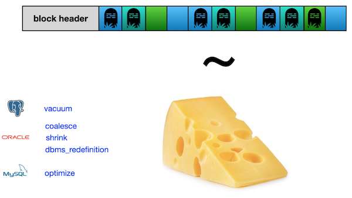

Let’s make a cheese of our data! :-)

  </details>
  


<details>
<summary> ## Chapter II General Rules</summary>

- Use this page as the only reference. Do not listen to any rumors and speculations on how to prepare your solution.
 > Используйте эту страницу как единственную ссылку. Не слушайте никаких слухов и домыслов о том, как подготовить свое решение.  
- Please make sure you are using the latest version of PostgreSQL.
- That is completely OK if you are using IDE to write a source code (aka SQL script).
- To be assessed your solution must be in your GIT repository.
  > Для оценки ваше решение должно находиться в вашем репозитории GIT.
- Your solutions will be evaluated(оценивается) by your piscine mates.
 >  Ваши решения будут оценены вашими товарищами по бассейну
- You should not leave in your directory any other file than those explicitly specified by the exercise instructions. It is recommended that you modify your `.gitignore` to avoid accidents.
- Do you have a question? Ask your neighbor on the right. Otherwise, try with your neighbor on the left.
- Your reference manual: mates / Internet / Google. 
- Read the examples carefully. They may require things that are not otherwise specified in the subject.
- And may the SQL-Force be with you!
- Absolutely everything can be presented in SQL! Let’s start and have fun!
  </details>
  
 

<details>
<summary> ## Chapter III Rules of the day</summary>

- Please make sure you have an own database and access for it on your PostgreSQL cluster. 
- Please download a [script](materials/model.sql) with Database Model here and apply the script to your database (you can use command line with psql or just run it through any IDE, for example DataGrip from JetBrains or pgAdmin from PostgreSQL community). 
- All tasks contain a list of Allowed and Denied sections with listed database options, database types, SQL constructions etc. Please have a look at the section before you start.
- Please take a look at the Logical View of our Database Model. 


1. **pizzeria** table (Dictionary Table with available pizzerias)
- field id - primary key
- field name - name of pizzeria
- field rating - average rating of pizzeria (from 0 to 5 points)
2. **person** table (Dictionary Table with persons who loves pizza)
- field id - primary key
- field name - name of person
- field age - age of person
- field gender - gender of person
- field address - address of person
3. **menu** table (Dictionary Table with available menu and price for concrete pizza)
- field id - primary key
- field pizzeria_id - foreign key to pizzeria
- field pizza_name - name of pizza in pizzeria
- field price - price of concrete pizza
4. **person_visits** table (Operational Table with information about visits of pizzeria)
- field id - primary key
- field person_id - foreign key to person
- field pizzeria_id - foreign key to pizzeria
- field visit_date - date (for example 2022-01-01) of person visit 
5. **person_order** table (Operational Table with information about persons orders)
- field id - primary key
- field person_id - foreign key to person
- field menu_id - foreign key to menu
- field order_date - date (for example 2022-01-01) of person order 

Persons' visit and persons' order are different entities and don't contain any correlation between data. For example, a client can be in one restraunt (just looking at menu) and in this time make an order in different one by phone or by mobile application. Or another case,  just be at home and again make a call with order without any visits.
  </details>
  

<details>
<summary>Exercise 00 - Let’s find appropriate(Подходящий) prices for Kate</summary>


| Exercise 00: Let’s find appropriate prices for Kate |                                                                                                                          |
|---------------------------------------|--------------------------------------------------------------------------------------------------------------------------|
| Turn-in directory                     | ex00                                                                                                                     |
| Files to turn-in                      | `day03_ex00.sql`                                                                                 |
| **Allowed**                               |                                                                                                                          |
| Language                        | ANSI SQL                                                                                              |

Please write a SQL statement which returns a list of pizza names, pizza prices, pizzerias names and dates of visit for Kate and for prices in range from 800 to 1000 rubles. Please sort by pizza, price and pizzeria names. Take a look at the sample of data below.

> вернуть список наименование пиццы, цена, название пиццерии и в дату визита Кати и цена пиццы от 800 до 1000. Отсоритируйте по названию цены и названию пиццерии. Посмотрите на пример данных ниже
> В дни когда Катя посещала пиццерию, вывести список пицц, их цену и названия пиццерий с ценой от 800 до 1000. Результат должен быть отсортирован сначала по названию пиццы потом по цене и затем по названию пиццерий. Ниже представлен вывод

| pizza_name | price | pizzeria_name | visit_date |
| ------ | ------ | ------ | ------ |
| cheese pizza | 950 | DinoPizza | 2022-01-04 |
| pepperoni pizza | 800 | Best Pizza | 2022-01-03 |
| pepperoni pizza | 800 | DinoPizza | 2022-01-04 |
| ... | ... | ... | ... |

[D03_ex00](src/day03_ex00.sql)

  </details>


<details>
<summary>Exercise 01 - Let’s find forgotten(забытый) menus</summary>


| Exercise 01: Let’s find forgotten menus|                                                                                                                          |
|---------------------------------------|--------------------------------------------------------------------------------------------------------------------------|
| Turn-in directory                     | ex01                                                                                                                     |
| Files to turn-in                      | `day03_ex01.sql`                                                                                 |
| **Allowed**                               |                                                                                                                          |
| Language                        | ANSI SQL                                                                                              |
| **Denied**                               |                                                                                                                          |
| SQL Syntax Construction                        | any type of `JOINs`                                                                                              |

Please find all menu identifiers which are not ordered by anyone. The result should be sorted by identifiers. The sample of output data is presented below.

> найдите все идентификаторы в меню? которые никто не заказывал. Результат должен быть отсортирован. Простой вывод представлен ниже. 
 
| menu_id |
| ------ |
| 5 |
| 10 |
| ... |

[D03_ex01](src/day03_ex01.sql)
  </details>
  


<details>
<summary>Exercise 02 - Let’s find forgotten pizza and pizzerias</summary>


| Exercise 02: Let’s find forgotten pizza and pizzerias|                                                                                                                          |
|---------------------------------------|--------------------------------------------------------------------------------------------------------------------------|
| Turn-in directory                     | ex02                                                                                                                     |
| Files to turn-in                      | `day03_ex02.sql`                                                                                 |
| **Allowed**                               |                                                                                                                          |
| Language                        | ANSI SQL                                                                                              |

Please use SQL statement from Exercise #01 and show pizza names from pizzeria which are not ordered by anyone, including corresponding prices also. The result should be sorted by pizza name and price. The sample of output data is presented below.

> Используя запрос из упраженния 1 и покажите названия пицц из пиццерий которые никто никогда не заказывал, включая соответвующую цену. Результат должен быть отсортирован по названию пиццы и цене. Простой вывод данных представлен ниже.

| pizza_name | price | pizzeria_name |
| ------ | ------ | ------ |
| cheese pizza | 700 | Papa Johns |
| cheese pizza | 780 | DoDo Pizza |
| ... | ... | ... |

[D03_ex02](src/day03_ex02.sql)

</details>
  
<details>
<summary> Exercise 03 - Let’s compare(сравнивать) visits</summary>

| Exercise 03: Let’s compare visits |                                                                                                                          |
|---------------------------------------|--------------------------------------------------------------------------------------------------------------------------|
| Turn-in directory                     | ex03                                                                                                                     |
| Files to turn-in                      | `day03_ex03.sql`                                                                                 |
| **Allowed**                               |                                                                                                                          |
| Language                        | ANSI SQL                                                                                              |

Please find pizzerias that have been visited more often(часто) by women or by men. For any SQL operators with sets save duplicates (UNION ALL, EXCEPT ALL, INTERSECT ALL constructions). Please sort a result by the pizzeria name. The data sample is provided below.

> найти пиццерии которые часто посещали мужчины или женщины. для любого оператора множестово вывода должно сохранять дубликаты (UNION ALL, EXCEPT ALL, INTERSECT ALL constructions). Результат отсортируйте по назанию пиццерий. пример вывода : 

| pizzeria_name | 
| ------ | 
| Best Pizza | 
| Dominos |
| ... |

[D03_ex03](src/day03_ex03.sql)
  </details>
  

<details>
<summary>Exercise 04 - Let’s compare orders</summary>

| Exercise 04: Let’s compare orders |                                                                                                                          |
|---------------------------------------|--------------------------------------------------------------------------------------------------------------------------|
| Turn-in directory                     | ex04                                                                                                                     |
| Files to turn-in                      | `day03_ex04.sql`                                                                                 |
| **Allowed**                               |                                                                                                                          |
| Language                        | ANSI SQL                                                                                              |

Please find a union of pizzerias that have orders either from women or  from men. Other words, you should find a set of pizzerias names have been ordered by females only and make "UNION" operation with set of pizzerias names have been ordered by males only. Please be aware(осведомленный) with word “only” for both genders. For any SQL operators with sets don’t save duplicates (`UNION`, `EXCEPT`, `INTERSECT`).  Please sort a result by the pizzeria name. The data sample is provided below.

> найти пиццерий в которыйх были заказы как мужчин так и женщин. Другими словами, вам надо найти множество названий пиццерий в который заказывали только женщины и обеденить с множеством пиццерий где заказывали только мужчины. Пожалуйста убедитесь со словом "только" для обеих полов. Для любых операторова SQL в множестве не должно быть дублей  (`UNION`, `EXCEPT`, `INTERSECT`). Результат отсортируйте. Пример  вывода ниже :

| pizzeria_name | 
| ------ | 
| Papa Johns | 

[D03_ex04](src/day03_ex04.sql)
  </details>


<details>
<summary>Exercise 05 - Visited but did not make any order</summary>


| Exercise 05: Visited but did not make any order |                                                                                                                          |
|---------------------------------------|--------------------------------------------------------------------------------------------------------------------------|
| Turn-in directory                     | ex05                                                                                                                     |
| Files to turn-in                      | `day03_ex05.sql`                                                                                 |
| **Allowed**                               |                                                                                                                          |
| Language                        | ANSI SQL                                                                                              |

Please write a SQL statement which returns a list of pizzerias which Andrey visited but did not make any orders. Please order by the pizzeria name. The sample of data is provided below.

> Вернуть список пиццерй с визитом Андрея но в которых он не сделал заказ. Сортируйте по названию. пример вывода ниже :

| pizzeria_name | 
| ------ | 
| Pizza Hut | 


[D03_ex05](src/day03_ex05.sql)

  </details>


<details>
<summary>Exercise 06 - Find price-similarity pizzas</summary>


| Exercise 06: Find price-similarity pizzas |                                                                                                                          |
|---------------------------------------|--------------------------------------------------------------------------------------------------------------------------|
| Turn-in directory                     | ex06                                                                                                                     |
| Files to turn-in                      | `day03_ex06.sql`                                                                                 |
| **Allowed**                               |                                                                                                                          |
| Language                        | ANSI SQL                                                                                              |

Please find the same pizza names who have the same price, but from different pizzerias. Make sure that the result is ordered by pizza name. The sample of data is presented below. Please make sure your column names are corresponding column names below.

> Найти несколько пиц названия которых имеют одинаковую стоимость но в разных пицериях. Убедитесь что результат отсортирован по названию пицц. Простоой вывод представлен ниже. Пожалуйста проверьте что названия столбцов такие же как ниже. 

| pizza_name | pizzeria_name_1 | pizzeria_name_2 | price |
| ------ | ------ | ------ | ------ |
| cheese pizza | Best Pizza | Papa Johns | 700 |
| ... | ... | ... | ... |
 
  [D03_ex06](src/day03_ex06.sql)
  
  </details>


<details>
<summary>Exercise 07 - Let’s cook a new type of pizza</summary>


| Exercise 07: Let’s cook a new type of pizza |                                                                                                                          |
|---------------------------------------|--------------------------------------------------------------------------------------------------------------------------|
| Turn-in directory                     | ex07                                                                                                                     |
| Files to turn-in                      | `day03_ex07.sql`                                                                                 |
| **Allowed**                               |                                                                                                                          |
| Language                        | ANSI SQL                                                                                              |

Please register a new pizza with name “greek pizza” (use id = 19) with price 800 rubles in “Dominos” restaurant (pizzeria_id = 2).  
**Warning**: this exercise will probably(вероятно) be the cause  of changing data in the wrong way. Actually, you can restore the initial database model with data from the link in the “Rules of the day” section.

> ** Внимание**: это упражнение, вероятно, приведет к неправильному изменению данных. На самом деле, вы можете восстановить исходную модель базы данных, используя данные по ссылке в разделе “Правила дня”.

 
  [D03_ex07](src/day03_ex07.sql)
  
  </details>


<details>
<summary>Exercise 08 - Let’s cook a new type of pizza with more dynamics</summary>

| Exercise 08: Let’s cook a new type of pizza with more dynamics |                                                                                                                          |
|---------------------------------------|--------------------------------------------------------------------------------------------------------------------------|
| Turn-in directory                     | ex08                                                                                                                     |
| Files to turn-in                      | `day03_ex08.sql`                                                                                 |
| **Allowed**                               |                                                                                                                          |
| Language                        | ANSI SQL                                                                                              |           
| **Denied**                               |                                                                                                                          |
| SQL Syntax Pattern                        | Don’t use direct numbers for identifiers of Primary Key and pizzeria  
>Не используйте прямые цифры для идентификаторов первичного ключа и меню|       

Please register a new pizza with name “sicilian pizza” (whose id should be calculated by formula is “maximum id value + 1”) with a price of 900 rubles in “Dominos” restaurant (please use internal query to get identifier of pizzeria).  
**Warning**: this exercise will probably be the cause  of changing data in the wrong way. Actually, you can restore the initial database model with data from the link in the “Rules of the day” section and replay script from Exercise 07.

> Пожалуйста, зарегистрируйте новую пиццу с названием “сицилийская пицца” (идентификатор которой должен быть рассчитан по формуле “максимальное значение идентификатора + 1”) стоимостью 900 рублей в ресторане “Доминос” (пожалуйста, используйте внутренний запрос для получения идентификатора пиццерии).
>** Внимание**: это упражнение, вероятно, приведет к неправильному изменению данных. На самом деле, вы можете восстановить исходную модель базы данных, используя данные по ссылке в разделе “Правила дня” и воспроизвести сценарий из упражнения 07.

  [D03_ex08](src/day03_ex08.sql)

  </details>


<details>
<summary>Exercise 09 - New pizza means new visits</summary>

| Exercise 09: New pizza means new visits |                                                                                                                          |
|---------------------------------------|--------------------------------------------------------------------------------------------------------------------------|
| Turn-in directory                     | ex09                                                                                                                     |
| Files to turn-in                      | `day03_ex09.sql`                                                                                 |
| **Allowed**                               |                                                                                                                          |
| Language                        | ANSI SQL                                                                                              |
| **Denied**                               |                                                                                                                          |
| SQL Syntax Pattern                        | Don’t use direct numbers for identifiers of Primary Key and pizzeria                                                                                               |       

Please register new visits into Dominos restaurant from Denis and Irina on 24th of February 2022.
**Warning**: this exercise will probably be the cause  of changing data in the wrong way. Actually, you can restore the initial database model with data from the link in the “Rules of the day” section and replay script from Exercises 07 and 08..

> ** Внимание**: это упражнение, вероятно, приведет к неправильному изменению данных. На самом деле, вы можете восстановить исходную модель базы данных, используя данные по ссылке в разделе “Правила дня” и воспроизвести сценарий из упражнения 07 и 08 .  

[D03_ex09](src/day03_ex09.sql)

  </details>


<details>
<summary>Exercise 10 - New visits means new orders</summary>


| Exercise 10: New visits means new orders |                                                                                                                          |
|---------------------------------------|--------------------------------------------------------------------------------------------------------------------------|
| Turn-in directory                     | ex10                                                                                                                     |
| Files to turn-in                      | `day03_ex10.sql`                                                                                 |
| **Allowed**                               |                                                                                                                          |
| Language                        | ANSI SQL                                                                                              |
| **Denied**                               |                                                                                                                          |
| SQL Syntax Pattern                        | Don’t use direct numbers for identifiers of Primary Key and pizzeria                                                                                               |     


Please register new orders from Denis and Irina on 24th of February 2022 for the new menu with “sicilian pizza”.
**Warning**: this exercise will probably be the cause  of changing data in the wrong way. Actually, you can restore the initial database model with data from the link in the “Rules of the day” section and replay script from Exercises 07 , 08 and 09.

** Внимание**: это упражнение, вероятно, приведет к неправильному изменению данных. На самом деле, вы можете восстановить исходную модель базы данных, используя данные по ссылке в разделе “Правила дня” и воспроизвести сценарий из упражнения 07.

[D03_ex10](src/day03_ex10.sql)

  </details>


<details>
<summary>Exercise 11 - “Improve” a price for clients</summary>
## 


| Exercise 11: “Improve” a price for clients|                                                                                                                          |
|---------------------------------------|--------------------------------------------------------------------------------------------------------------------------|
| Turn-in directory                     | ex11                                                                                                                     |
| Files to turn-in                      | `day03_ex11.sql`                                                                                 |
| **Allowed**                               |                                                                                                                          |
| Language                        | ANSI SQL                                                                                              |
    
Please change the price for “greek pizza” on -10% from the current value.
**Warning**: this exercise will probably be the cause  of changing data in the wrong way. Actually, you can restore the initial database model with data from the link in the “Rules of the day” section and replay script from Exercises 07 , 08 ,09 and 10.

** Внимание**: это упражнение, вероятно, приведет к неправильному изменению данных. На самом деле, вы можете восстановить исходную модель базы данных, используя данные по ссылке в разделе “Правила дня” и воспроизвести сценарий из упражнения 07.

[D03_ex11](src/day03_ex11.sql)

  </details>


<details>
<summary>Exercise 12 - New orders are coming!</summary>


| Exercise 12: New orders are coming!|                                                                                                                          |
|---------------------------------------|--------------------------------------------------------------------------------------------------------------------------|
| Turn-in directory                     | ex12                                                                                                                     |
| Files to turn-in                      | `day03_ex12.sql`                                                                                 |
| **Allowed**                               |                                                                                                                          |
| Language                        | ANSI SQL                                                                                              |
| SQL Syntax Construction                        | `generate_series(...)`                                                                                              |
| SQL Syntax Patten                        | Please use “insert-select” pattern
`INSERT INTO ... SELECT ...`|
| **Denied**                               |                                                                                                                          |
| SQL Syntax Patten                        | - Don’t use direct numbers for identifiers of Primary Key, and menu 
- Don’t use window functions like `ROW_NUMBER( )`
- Don’t use atomic `INSERT` statements |

Please register new orders from all persons for “greek pizza” on 25th of February 2022.
**Warning**: this exercise will probably be the cause  of changing data in the wrong way. Actually, you can restore the initial database model with data from the link in the “Rules of the day” section and replay script from Exercises 07 , 08 ,09 , 10 and 11.
** Внимание**: это упражнение, вероятно, приведет к неправильному изменению данных. На самом деле, вы можете восстановить исходную модель базы данных, используя данные по ссылке в разделе “Правила дня” и воспроизвести сценарий из упражнения 07.

[D03_ex12](src/day03_ex12.sql)

  </details>


<details>
<summary>Exercise 13 - Money back to our customers</summary>


| Exercise 13: Money back to our customers|                                                                                                                          |
|---------------------------------------|--------------------------------------------------------------------------------------------------------------------------|
| Turn-in directory                     | ex13                                                                                                                     |
| Files to turn-in                      | `day03_ex13.sql`                                                                                 |
| **Allowed**                               |                                                                                                                          |
| Language                        | ANSI SQL                                                                                              |
    
Please write 2 SQL (DML) statements that delete all new orders from exercise #12 based on order date. Then delete “greek pizza” from the menu. 
**Warning**: this exercise will probably be the cause  of changing data in the wrong way. Actually, you can restore the initial database model with data from the link in the “Rules of the day” section and replay script from Exercises 07 , 08 ,09 , 10 , 11, 12 and 13.
** Внимание**: это упражнение, вероятно, приведет к неправильному изменению данных. На самом деле, вы можете восстановить исходную модель базы данных, используя данные по ссылке в разделе “Правила дня” и воспроизвести сценарий из упражнения 07 , 08 ,09 , 10 , 11, 12 and 13.

  [D03_ex13](src/day03_ex13.sql)
  
  </details>

