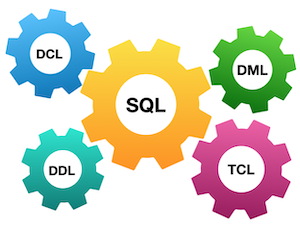
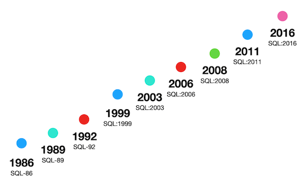

# Day 01 - Piscine SQL

## _First steps working with sets and JOINs in SQL(начало работы с наборами и JOIN в SQL)_

Resume: Today you will see how to get needed data based on sets constructions and simple JOINs  
>*(Сегодня вы увидите, как получить необходимые данные на основе наборов, конструкций и простых соединений)*

## Contents

1. [Chapter I](#chapter-i) [Preamble](#preamble)
2. [Chapter II](#chapter-ii) [General Rules](#general-rules)
3. [Chapter III](#chapter-iii) [Rules of the day](#rules-of-the-day)  
4. [Chapter IV](#chapter-iv) [Exercise 00 - Let’s make UNION dance](#exercise-00-lets-make-union-dance)  
5. [Chapter V](#chapter-v) \
    5.1. [Exercise 01 - UNION dance with subquery](#exercise-01-union-dance-with-subquery)  
6. [Chapter VI](#chapter-vi) \
    6.1. [Exercise 02 - Duplicates or not duplicates](#exercise-02-duplicates-or-not-duplicates)  
7. [Chapter VII](#chapter-vii) [Exercise 03 - “Hidden” Insights](#exercise-03-hidden-insights)  
8. [Chapter VIII](#chapter-viii) \
    8.1. [Exercise 04 - Difference? Yep, let's find the difference between multisets](#exercise-04-difference-yep-lets-find-the-difference-between-multisets)
9. [Chapter IX](#chapter-ix) \
    9.1. [Exercise 05 - Did you hear about Cartesian Product?](#exercise-05-did-you-hear-about-cartesian-product)
10. [Chapter X](#chapter-x) \
    10.1. [Exercise 06 - Lets see on “Hidden” Insights](#exercise-06-lets-see-on-hidden-insights)
11. [Chapter XI](#chapter-xi) \
    11.1. [Exercise 07 - Just make a JOIN](#exercise-07-just-make-a-join)
12. [Chapter XII](#chapter-xii) \
    12.1. [Exercise 08 - Migrate JOIN to NATURAL JOIN](#exercise-08-migrate-join-to-natural-join)
13. [Chapter XIII](#chapter-xiii) \
    13.1. [Exercise 09 - IN versus EXISTS](#exercise-09-in-versus-exists)
14. [Chapter XIV](#chapter-xiv) \
    14.1. [Exercise 10 - Global JOIN](#exercise-10-global-join)

## Chapter I
## Preamble

In many aspects, sets are used in Relational Databases. Not just, make UNION or find MINUS between sets. Sets are also good candidates to make recursive queries.  
>(Во многих аспектах, множества используются в реляционных базах данных. Не только для объединения или поиска отрицательных значений между множествами. Множества также хороши для выполнения рекурсивных запросов)

There are the next set operators in PostgreSQL. 
- UNION [ALL]
- EXCEPT [ALL] 
- INTERSECT [ALL]

Keyword “ALL” means to save duplicates of rows in the result.  
> ключевое слово “ALL” выведет в результат строки с дублями  
The main rules to work with sets are below (основные правила для работы с множествами) :
- The main SQL provides a final names of attributes for whole query
> 
- The attributes of controlled SQL should satisfied number of columns and corresponding family types of main SQL

Moreover, SQL sets are useful  to calculate some specific Data Science metrics, for example Jaccard distance between 2 objects based on existing data features.

## Chapter II
## General Rules

- Use this page as the only reference. Do not listen to any rumors and speculations on how to prepare your solution.
- Please make sure you are using the latest version of PostgreSQL.
- That is completely OK if you are using IDE to write a source code (aka SQL script).
- To be assessed your solution must be in your GIT repository.
- Your solutions will be evaluated by your piscine mates.
- You should not leave in your directory any other file than those explicitly specified by the exercise instructions. It is recommended that you modify your `.gitignore` to avoid accidents.
- Do you have a question? Ask your neighbor on the right. Otherwise, try with your neighbor on the left.
- Your reference manual: mates / Internet / Google. 
- Read the examples carefully. They may require things that are not otherwise specified in the subject.
- And may the SQL-Force be with you!
- Absolutely everything can be presented in SQL! Let’s start and have fun!

## Chapter III
## Rules of the day

- Please make sure you have an own(собственный) database and access for it on your PostgreSQL cluster. 
- Please download a [script](materials/model.sql) with Database Model here and apply the script to your database (you can use command line with psql or just run it through any IDE, for example DataGrip from JetBrains or pgAdmin from PostgreSQL community). 
- All tasks contain a list of Allowed and Denied sections with listed database options, database types, SQL constructions etc. Please have a look at the section before you start.
- Please take a look at the Logical View of our Database Model. (посмотрите логическое представление модели базы данных ниже)

1. **pizzeria** table (Dictionary Table with available pizzerias)
- field **id** — primary key 
- field **name** — название пиццерии  
- field **rating** — average(средний) рейтинг пицерии (от 0 до 5)
2. **person** table (Dictionary Table with persons who loves pizza)
- field **id** — primary key
- field **name** — Имя  
- field **age** — возраст  
- field **gender** — пол  
- field **address** — адресс  
3. **menu** table (Dictionary Table with available menu and price for concrete pizza)
- field  **id** - primary key
- field **pizzeria_id** - foreign key to pizzeria
- field **pizza_name** - название пиццы в пицерии
- field **price** - цена пиццы
4. **person_visits** table (Operational Table with information about visits of pizzeria)
- field **id** - primary key
- field person_id - foreign key to person
- field pizzeria_id - foreign key to pizzeria
- field visit_date - date (for example 2022-01-01) of person visit 
5. **person_order** table (Operational Table with information about persons orders)
- field  **id** - primary key
- field person_id - foreign key to person
- field menu_id - foreign key to menu
- field order_date - date (for example 2022-01-01) of person order 

Persons' visit and persons' order are different entities and don't contain any correlation between data.  
For example, a client can be in one restraunt (just looking at menu) and in this time make an order in different one by phone or by mobile application.  
>в заданиях клиенты могут быть в одном ресторане (только посмотреть меню) и в это время делать заказ в другом по телефону или из мобильного приложения.
Or another case,  just be at home and again make a call with order without any visits.

## Chapter IV
## Exercise 00 - Let’s make UNION dance

| Exercise 00: Let’s make UNION dance |                                                                                                                          |
|---------------------------------------|--------------------------------------------------------------------------------------------------------------------------|
| Turn-in directory                     | ex00                                                                                                                     |
| Files to turn-in                      | `day01_ex00.sql`                                                                                 |
| **Allowed**                               |                                                                                                                          |
| Language                        | ANSI SQL                                                                                              |

Please write a SQL statement which returns menu’s identifier and pizza names from `menu` table and person’s identifier and person name from `person` table in one global list (with column names as presented on a sample below) ordered by object_id and then by object_name columns.  
  
(Напишите SQL запрос который вернет id меню и название пицы из таблицы `menu` и id человека и его имя из таблицы `person` в одном списке вывода (с названием столбцов как показано ниже) отсортируйте сначала по object_id а затем по object_name

| object_id | object_name |
| ------ | ------ |
| 1 | Anna |
| 1 | cheese pizza |
| ... | ... |

[D01_ex01](src/day01_ex00.sql)

## Chapter V
## Exercise 01 - UNION dance with subquery (с подзапросом) 

| Exercise 01: UNION dance with subquery|                                                                                                                          |
|---------------------------------------|--------------------------------------------------------------------------------------------------------------------------|
| Turn-in directory                     | ex01                                                                                                                     |
| Files to turn-in                      | `day01_ex01.sql`                                                                                 |
| **Allowed**                               |                                                                                                                          |
| Language                        | ANSI SQL                                                                                              |

Please modify a SQL statement from “exercise 00” by removing the object_id column. Then change ordering by object_name for part of data from the `person` table and then from `menu` table (like presented on a sample below). Please save duplicates!  

(Измените SQL запрос из прошлого упражнения уберите столбец object_id. Затем измените сортировку по object_name сначало сортируйте значения из таблицы  `person` и затем только из таблицы `menu`(как поаказано ниже). Записи могут дублироваться!

| object_name |
| ------ |
| Andrey |
| Anna |
| ... |
| cheese pizza |
| cheese pizza |
| ... |

[D01_ex01](src/day01_ex01.sql)

## Chapter VI
## Exercise 02 - Duplicates or not duplicates

| Exercise 02: Duplicates or not duplicates|                                                                                                                          |
|---------------------------------------|--------------------------------------------------------------------------------------------------------------------------|
| Turn-in directory                     | ex02                                                                                                                     |
| Files to turn-in                      | `day01_ex02.sql`                                                                                 |
| **Allowed**                               |                                                                                                                          |
| Language                        | ANSI SQL                                                                                              |
| **Denied**                               |                                                                                                                          |
| SQL Syntax Construction                        | `DISTINCT`, `GROUP BY`, `HAVING`, any type of `JOINs`                                                                                              |

Please write a SQL statement which returns unique pizza names from the `menu` table and orders by pizza_name column in descending mode. Please pay attention to the Denied section.  

(напишите SQL запрос который возвращает только уникальные названия пицц из таблицы `menu` и сортирует по названию пицц в убывающем порядке. обратите внимание некоторые конструкции запрещены )

[D01_ex02](src/day01_ex02.sql)
## Chapter VII
## Exercise 03 - “Hidden” Insights

| Exercise 03: “Hidden” Insights |                                                                                                                          |
|---------------------------------------|--------------------------------------------------------------------------------------------------------------------------|
| Turn-in directory                     | ex03                                                                                                                     |
| Files to turn-in                      | `day01_ex03.sql`                                                                                 |
| **Allowed**                               |                                                                                                                          |
| Language                        | ANSI SQL                                                                                              |
| **Denied**                               |                                                                                                                          |
| SQL Syntax Construction                        |  any type of `JOINs`                                                                                              |

Please write a SQL statement which returns common rows for attributes order_date, person_id from `person_order` table from one side and visit_date, person_id from `person_visits` table from the other side (please see a sample below). In other words, let’s find identifiers of persons, who visited and ordered some pizza on the same day. Actually, please add ordering by action_date in ascending mode and then by person_id in descending mode.  
который возвращает строки из атрибутов даты заказа, персон_ид из таблицы `person_order` с одной стороны и дата визита из `person_visits` таблицы из сдругой сторовны (пожалуйста смотрите пример ниже). в других словах, давай найдем идентификаторы людей, кто посещал и заказывал 

| action_date | person_id |
| ------ | ------ |
| 2022-01-01 | 6 |
| 2022-01-01 | 2 |
| 2022-01-01 | 1 |
| 2022-01-03 | 7 |
| 2022-01-04 | 3 |
| ... | ... |
[D01_ex03](src/day01_ex03.sql)
## Chapter VIII
## Exercise 04 - Difference? Yep, let's find the difference between multisets.

| Exercise 04: Difference? Yep, let's find the difference between multisets. |                                                                                                                          |
|---------------------------------------|--------------------------------------------------------------------------------------------------------------------------|
| Turn-in directory                     | ex04                                                                                                                     |
| Files to turn-in                      | `day01_ex04.sql`                                                                                 |
| **Allowed**                               |                                                                                                                          |
| Language                        | ANSI SQL                                                                                              |
| **Denied**                               |                                                                                                                          |
| SQL Syntax Construction                        |  any type of `JOINs`                                                                                              |

Please write a SQL statement which returns a difference (minus) of person_id column values with saving duplicates between `person_order` table and `person_visits` table for order_date and visit_date are for 7th of January of 2022  
> вернуть разницу значения столбца  person_id с дублями  между  `person_order` и  `person_visits` таблицами дата заказа и дата визита 7  января 2022  
[D01_ex04](src/day01_ex04.sql)
## Chapter IX
## Exercise 05 - Did you hear about Cartesian Product? (Вы слышали о Декартовом произведении)

| Exercise 05: Декартово произведение |                                                                                                                          |
|---------------------------------------|--------------------------------------------------------------------------------------------------------------------------|
| Turn-in directory                     | ex05                                                                                                                     |
| Files to turn-in                      | `day01_ex05.sql`                                                                                 |
| **Allowed**                               |                                                                                                                          |
| Language                        | ANSI SQL                                                                                              |

Please write a SQL statement which returns all possible combinations between `person` and `pizzeria` tables and please set ordering by person identifier and then by pizzeria identifier columns. Please take a look at the result sample below. Please be aware column's names can be different for you.  
> вернуть все возможные комбинации между таблицами `person` и `pizzeria` и отсортируйте по идентификатору персоны и затем по идентификатору пиццерии. посмотрите на пример результата ниже. Ознакомьтесь с названиями столбцов 

| person.id | person.name | age | gender | address | pizzeria.id | pizzeria.name | rating |
| ------ | ------ | ------ | ------ | ------ | ------ | ------ | ------ |
| 1 | Anna | 16 | female | Moscow | 1 | Pizza Hut | 4.6 |
| 1 | Anna | 16 | female | Moscow | 2 | Dominos | 4.3 |
| ... | ... | ... | ... | ... | ... | ... | ... |

[D01_ex05](src/day01_ex05.sql)
## Chapter X
## Exercise 06 - Lets see on “Hidden” Insights

| Exercise 06: Lets see on “Hidden” Insights |                                                                                                                          |
|---------------------------------------|--------------------------------------------------------------------------------------------------------------------------|
| Turn-in directory                     | ex06                                                                                                                     |
| Files to turn-in                      | `day01_ex06.sql`                                                                                 |
| **Allowed**                               |                                                                                                                          |
| Language                        | ANSI SQL                                                                                              |

Let's return our mind back to exercise #03 and change our SQL statement to return person names instead(вместо) of person identifiers and change ordering by action_date in ascending(возрастающем) mode and then by person_name in descending mode. Please take a look at a data sample below.

> Давай вернемся к нашему решению из упражнения #03 и изменим запрос так что бы он возвращал имена вместо идентификаторов персон и изменим сортирувоку по action_date в возрастающем порядке а затем по именам в убывающем порядке. посмотри на данные из примера ниже.  

| action_date | person_name |
| ------ | ------ |
| 2022-01-01 | Irina |
| 2022-01-01 | Anna |
| 2022-01-01 | Andrey |
| ... | ... |

[D01_ex06 v1](src/day01_ex06_v1.sql)  
[D01_ex06 v2](src/day01_ex06_v2.sql)
## Chapter XI
## Exercise 07 - Just make a JOIN

| Exercise 07: Just make a JOIN |                                                                                                                          |
|---------------------------------------|--------------------------------------------------------------------------------------------------------------------------|
| Turn-in directory                     | ex07                                                                                                                     |
| Files to turn-in                      | `day01_ex07.sql`                                                                                 |
| **Allowed**                               |                                                                                                                          |
| Language                        | ANSI SQL                                                                                              |

Please write a SQL statement which returns the date of order from the `person_order` table and corresponding person name (name and age are formatted as in the data sample below) which made an order from the `person` table. Add a sort by both columns in ascending mode.  

> вернуть дату заказа из таблицы `person_order` и  имена персон ( имя и возраст форматируй как данные в примере ниже) сделай сортирвку в таблице персон.  добавь сортирвку по возрастанию 

| order_date | person_information |
| ------ | ------ |
| 2022-01-01 | Andrey (age:21) |
| 2022-01-01 | Andrey (age:21) |
| 2022-01-01 | Anna (age:16) |
| ... | ... |

[D01_ex07](src/day01_ex07.sql)  

## Chapter XII
## Exercise 08 - Migrate JOIN to NATURAL JOIN

| Exercise 08: Migrate JOIN to NATURAL JOIN |                                                                                                                          |
|---------------------------------------|--------------------------------------------------------------------------------------------------------------------------|
| Turn-in directory                     | ex08                                                                                                                     |
| Files to turn-in                      | `day01_ex08.sql`                                                                                 |
| **Allowed**                               |                                                                                                                          |
| Language                        | ANSI SQL                                                                                              |
| SQL Syntax Construction                        | `NATURAL JOIN`                                                                                              |
| **Denied**                               |                                                                                                                          |
| SQL Syntax Construction                        | other type of  `JOINs`                                                                                              |

Please rewrite a SQL statement from exercise #07 by using NATURAL JOIN construction. The result must be the same like for exercise #07.  
> Перепиши запрос из прошлого упражения используя  NATURAL JOIN конструкцию. Результат должен быть таким же как и в прошлом упражении
[D01_ex08 v1](src/day01_ex08_v1.sql)  
[D01_ex08 v2](src/day01_ex08_v2.sql)  
## Chapter XIII
## Exercise 09 - IN versus EXISTS

| Exercise 09: IN versus EXISTS |                                                                                                                          |
|---------------------------------------|--------------------------------------------------------------------------------------------------------------------------|
| Turn-in directory                     | ex09                                                                                                                     |
| Files to turn-in                      | `day01_ex09.sql`                                                                                 |
| **Allowed**                               |                                                                                                                          |
| Language                        | ANSI SQL                                                                                              |

Please write 2 SQL statements which return a list of pizzerias names which have not been visited by persons by using IN for 1st one and EXISTS for the 2nd one.  
> напиши 2 запросв которые вернуть список названий пиццерий в которые никто не приходил с использованием IN для первого и EXISTS для второго запроса. 
[D01_ex09](src/day01_ex09.sql)  
## Chapter XIV
## Exercise 10 - Global JOIN

| Exercise 10: Global JOIN |                                                                                                                          |
|---------------------------------------|--------------------------------------------------------------------------------------------------------------------------|
| Turn-in directory                     | ex10                                                                                                                     |
| Files to turn-in                      | `day01_ex10.sql`                                                                                 |
| **Allowed**                               |                                                                                                                          |
| Language                        | ANSI SQL                                                                                              |

Please write a SQL statement which returns a list of the person names which made an order for pizza in the corresponding pizzeria. The sample result (with named columns) is provided below and yes ... please make ordering by 3 columns in ascending mode.
> верни список имен кто делал заказ пиццы в пиццерии. Пример рузультат (с названиями столбцов) есть  

| person_name | pizza_name | pizzeria_name | 
| ------ | ------ | ------ |
| Andrey | cheese pizza | Dominos |
| Andrey | mushroom pizza | Dominos |
| Anna | cheese pizza | Pizza Hut |
| ... | ... | ... |

