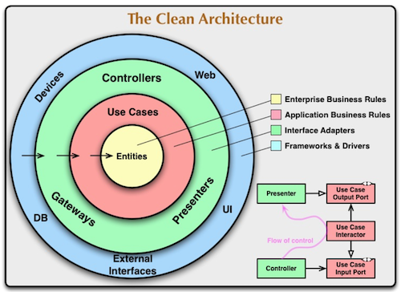
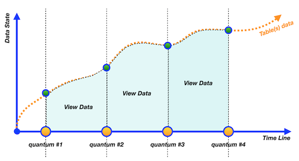

# Day 04 - Piscine SQL

## _Snapshots, virtual tables… What is going on?_
>Снимки, виртуальные таблицы... Что происходит?

Resume: Today you will see how to use a virtual view and physical snapshot of data
>Резюме: Сегодня вы увидите, как использовать виртуальное представление и физический снимок данных

Preamble

    

Why do we need virtual tables and materialized views in databases? Databases are just tables, aren't they? 
No, actually not. Databases are similar for object-oriented language. Just recall, you have a lot of abstraction in Java (I mean Java Interfaces). We need abstraction to achieve “Clean Architecture” and change objects with minimal effect on dependencies (sometimes it’s working :-). 
> Зачем нам нужны виртуальные таблицы и материализованные представления в базах данных? Базы данных — это просто таблицы, не так ли?
Нет, на самом деле нет. Базы данных похожи на объектно-ориентированные языки. Просто вспомните, в Java много абстракций (я имею в виду интерфейсы Java). Нам нужна абстракция, чтобы достичь «Чистой архитектуры» и изменять объекты с минимальным влиянием на зависимости (иногда это работает :-).

Moreover, there is a specific architectures’ pattern in the Relational Database with the name ANSI/SPARK.
This pattern splits objects on three levels: 
- external level
- conceptual level
- internal level

Therefore we can say that Virtual Tables and Materialized Views are physical interfaces between tables with data and user / application.
So, what is the difference then between 2 objects? The main difference is in the “freshness of data”. Below , you can see behaviors of these objects in graphical representation.

|  |  |
| ------ | ------ |
| View is a continuous object with the same data like in the underlying table(s), that are used to create this view. Other words, if we select data from view, view reroutes our query to underlying objects and then returns results for us. |  |
|  | Materialized View is a discrete object. Other words, we need to wait when the Materialized View will be refreshed based on an “event trigger” (for example, time schedule). This object always is behind actual data in underlying tables. |

Also, there are “a few” additional differences between View and Materialized View.
- Virtual Table can work with `INSERT/UPDATE/DELETE` traffic but with some restrictions. 
- Virtual Tables can have “Instead Of” Triggers to make a better control of incoming `INSERT/UPDATE/DELETE` traffic.
- Materialized View is ReadOnly object for `INSERT/UPDATE/DELETE` traffic
- Materialized Views can have user defined indexes on columns to speed up queries
  

General Rules

- Use this page as the only reference. Do not listen to any rumors and speculations on how to prepare your solution.
  > Используйте эту страницу как единственную ссылку. Не слушайте никаких слухов и домыслов о том, как подготовить свое решение.  
- Please make sure you are using the latest version of PostgreSQL.
- That is completely OK if you are using IDE to write a source code (aka SQL script).
- To be assessed your solution must be in your GIT repository.
- Your solutions will be evaluated by your piscine mates.
- You should not leave in your directory any other file than those explicitly specified by the exercise instructions. It is recommended that you modify your `.gitignore` to avoid accidents.
- Do you have a question? Ask your neighbor on the right. Otherwise, try with your neighbor on the left.
- Your reference manual: mates / Internet / Google. 
- Read the examples carefully. They may require things that are not otherwise specified in the subject.
- And may the SQL-Force be with you!
- Absolutely everything can be presented in SQL! Let’s start and have fun!

Exercise 00 - Let’s create separated views for persons(Давайте создадим отдельные представления для персон)

| Exercise 00: Let’s create separated views for persons |                                                                                                                          |
|---------------------------------------|--------------------------------------------------------------------------------------------------------------------------|
| Turn-in directory                     | ex00                                                                                                                     |
| Files to turn-in                      | `day04_ex00.sql`                                                                                 |
| **Allowed**                               |                                                                                                                          |
| Language                        | ANSI SQL                                                                                              |

Please create 2 Database Views (with similar attributes like the original table) based on simple filtering of gender of persons. Set the corresponding(соответствующий) names for the database views: `v_persons_female` and `v_persons_male`.
>Создайте 2 представления базы данных (с похожими атрибутами, как у исходной таблицы) на основе простой фильтрации пола лиц. Задайте соответствующие имена для представлений базы данных: `v_persons_female` и `v_persons_male`.

Exercise 01 - From parts to common view(от частей к общему виду)

    
| Exercise 01: From parts to common view|                                                                                                                          |
|---------------------------------------|--------------------------------------------------------------------------------------------------------------------------|
| Turn-in directory                     | ex01                                                                                                                     |
| Files to turn-in                      | `day04_ex01.sql`                                                                                 |
| **Allowed**                               |                                                                                                                          |
| Language                        | ANSI SQL                                                                                              |

Please use 2 Database Views from Exercise #00 and write SQL to get female and male person names in one list. Please set the order by person name. The sample of data is presented below.
>Используя 2 представления данных из упражнения#00 напишите SQL-скрипт который вернет имена мужчин и женщин в одном списке. Отсортируйте список по именам. Вид вывдоа представлен ниже. 

| name |
| ------ |
| Andrey |
| Anna |
| ... |

[D04_ex00](src/day04_ex00.sql)
[D04_ex01](src/day04_ex01.sql)

Exercise 02 - “Store” generated dates in one place("хранение" сгенерированных дат в одном месте)

    
| Exercise 02: “Store” generated dates in one place|                                                                                                                          |
|---------------------------------------|--------------------------------------------------------------------------------------------------------------------------|
| Turn-in directory                     | ex02                                                                                                                     |
| Files to turn-in                      | `day04_ex02.sql`                                                                                 |
| **Allowed**                               |                                                                                                                          |
| Language                        | ANSI SQL                                                                                              |
| SQL Syntax Construction                        | `generate_series(...)`                                                                                              |

Please create a Database View (with name `v_generated_dates`) which should be “store” generated dates from 1st to 31th of January 2022 in DATE type. Don’t forget about order for the generated_date column.  
> создайте представление (с именем `v_generated_dates`) которое должно сохранять сгенерированные данные с 1 по 31 января 2022 с типом DATE. Не забудьте отсортировать сгенерированные данные по дате.

| generated_date |
| ------ |
| 2022-01-01 |
| 2022-01-02 |
| ... |

[D04_ex02](src/day04_ex02.sql)

Exercise 03 - Find missing visit days with Database View(Найдите пропущенные дни посещений с помощью представлений)

| Exercise 03: Find missing visit days with Database View |                                                                                                                          |
|---------------------------------------|--------------------------------------------------------------------------------------------------------------------------|
| Turn-in directory                     | ex03                                                                                                                     |
| Files to turn-in                      | `day04_ex03.sql`                                                                                 |
| **Allowed**                               |                                                                                                                          |
| Language                        | ANSI SQL                                                                                              |

Please write a SQL statement which returns missing days for persons’ visits in January of 2022. Use `v_generated_dates` view for that task and sort the result by missing_date column. The sample of data is presented below.
> Напишите SQL-скрипт который вернет пропущенные дни посещений в январе 2022. Используейте представление `v_generated_dates` для этой задачи и отсортируйте результат по пропущенной дате. Пример вывода представлен ниже 

| missing_date |
| ------ |
| 2022-01-11 |
| 2022-01-12 |
| ... |

[D04_ex03](src/day04_ex03.sql)

Exercise 04 - Let’s find something from Set Theory(Давайте найдем что-нибудь из теории множеств)

| Exercise 04: Let’s find something from Set Theory |                                                                                                                          |
|---------------------------------------|--------------------------------------------------------------------------------------------------------------------------|
| Turn-in directory                     | ex04                                                                                                                     |
| Files to turn-in                      | `day04_ex04.sql`                                                                                 |
| **Allowed**                               |                                                                                                                          |
| Language                        | ANSI SQL                                                                                              |

Please write a SQL statement which satisfies(удовлетворяет) a formula `(R - S)∪(S - R)` .
Where R is the `person_visits` table with filter by 2nd of January 2022, S is also `person_visits` table but with a different filter by 6th of January 2022. Please make your calculations with sets under the `person_id` column and this column will be alone in a result. The result please sort by `person_id` column and your final SQL please present in `v_symmetric_union` (*) database view.

(*) to be honest, the definition “symmetric union” doesn’t exist in Set Theory. This is the author's interpretation, the main idea is based on the existing rule of symmetric difference. 

> Напишите SQL-запрос который удовлетворяет формуле `(R - S)∪(S - R)`.
> Где R это `person_visits` с фильтром по 2 января 2022, S это также `person_visits` но с другим фильтром по 6 января 2022. Пожалуйста, сделайте ваше вычисление с множеством над `person_id` столбцом и этот столбец должен быть единственным в результате. Результат отсортируйте по `person_id` и ваш финальное SQL представлет в `v_symmetric_union`  (*) представлении
> (*) Честно говоря, определения «симметричное объединение» в теории множеств не существует. Это интерпретация автора, основная идея основана на существующем правиле симметричной разности.

[D04_ex04](src/day04_ex04.sql)

Exercise 05 - Let’s calculate a discount price for each person(Давайте посчитаем цену скидки для каждой персоны)

| Exercise 05: Let’s calculate a discount price for each person |                                                                                                                          |
|---------------------------------------|--------------------------------------------------------------------------------------------------------------------------|
| Turn-in directory                     | ex05                                                                                                                     |
| Files to turn-in                      | `day04_ex05.sql`                                                                                 |
| **Allowed**                               |                                                                                                                          |
| Language                        | ANSI SQL                                                                                              |

Please create a Database View `v_price_with_discount` that returns a person's orders with person names, pizza names, real price and calculated column `discount_price` (with applied 10% discount and satisfies formula `price - price*0.1`). The result please sort by person name and pizza name and make a round for `discount_price` column to integer type. Please take a look at a sample result below.

>Создайте представление  `v_price_with_discount` которое возвращает заказы с именем, названием пицы, ценой и вычисляемый столбик  `discount_price`(с применением 10% скидки и высчитвываемом по формуле   `price - price*0.1`). Результат, пожалуйста, отсортируйте по имени и названию пиццы и округлите `discount_price` до целого типа. Пожалуйтса, обратите внимание на пример ниже. 

| name |  pizza_name | price | discount_price |
| ------ | ------ | ------ | ------ | 
| Andrey | cheese pizza | 800 | 720 | 
| Andrey | mushroom pizza | 1100 | 990 |
| ... | ... | ... | ... |

[D04_ex05](src/day04_ex05.sql)

 Exercise 06 - Materialization from virtualization

    
| Exercise 06: Materialization from virtualization |                                                                                                                          |
|---------------------------------------|--------------------------------------------------------------------------------------------------------------------------|
| Turn-in directory                     | ex06                                                                                                                     |
| Files to turn-in                      | `day04_ex06.sql`                                                                                 |
| **Allowed**                               |                                                                                                                          |
| Language                        | ANSI SQL                                                                                              |

Please create a Materialized View `mv_dmitriy_visits_and_eats` (with data included) based on SQL statement that finds the name of pizzeria Dmitriy visited on January 8, 2022 and could eat pizzas for less than 800 rubles (this SQL you can find out at Day #02 Exercise #07). 

To check yourself you can write SQL to Materialized View `mv_dmitriy_visits_and_eats` and compare results with your previous query.

> Создайте материализованное представление `mv_dmitriy_visits_and_eats` (с включенными данными) на основе оператора SQL, который находит название пиццерии, которую Дмитрий посетил 8 января 2022 года и мог съесть пиццу менее чем за 800 рублей (этот SQL вы можете найти в упражнении № 02 дня № 07).
> Чтобы проверить себя, вы можете написать SQL в материализованное представление `mv_dmitriy_visits_and_eats` и сравнить результаты с вашим предыдущим запросом.

[D04_ex06](src/day04_ex06.sql)

 Exercise 07 - Refresh our state (Обновить наше состояние) 

| Exercise 07: Refresh our state|                                                                                                                          |
|---------------------------------------|--------------------------------------------------------------------------------------------------------------------------|
| Turn-in directory                     | ex07                                                                                                                     |
| Files to turn-in                      | `day04_ex07.sql`                                                                                 |
| **Allowed**                               |                                                                                                                          |
| Language                        | ANSI SQL                                                                                              |
| **Denied**                               |                                                                                                                          |
| SQL Syntax Pattern                        | Don’t use direct numbers for identifiers of Primary Key, person and pizzeria                                                                                               |

Let's refresh data in our Materialized View `mv_dmitriy_visits_and_eats` from exercise #06. Before this action, please generate one more Dmitriy visit that satisfies the SQL clause of Materialized View except pizzeria that we can see in a result from exercise #06.
After adding a new visit please refresh a state of data for `mv_dmitriy_visits_and_eats`.

>Давайте обновим данные в нашем материализованном представлении `mv_dmitriy_visits_and_eats` из упражнения № 06. Перед этим действием, пожалуйста, сгенерируйте еще одно посещение Дмитрия, которое удовлетворяет предложению SQL материализованного представления, за исключением пиццерии, которую мы можем увидеть в результате из упражнения № 06.
>После добавления нового посещения, пожалуйста, обновите состояние данных для `mv_dmitriy_visits_and_eats`.

[D04_ex07](src/day04_ex07.sql)

 Exercise 08 - Just clear our database (Просто очистим нашу базу данных)

| Exercise 08: Just clear our database |                                                                                                                          |
|---------------------------------------|--------------------------------------------------------------------------------------------------------------------------|
| Turn-in directory                     | ex08                                                                                                                     |
| Files to turn-in                      | `day04_ex08.sql`                                                                                 |
| **Allowed**                               |                                                                                                                          |
| Language                        | ANSI SQL                                                                                              |           

After all our exercises were born a few Virtual Tables and one Materialized View. Let’s drop them!

[D04_ex08](src/day04_ex08.sql)

