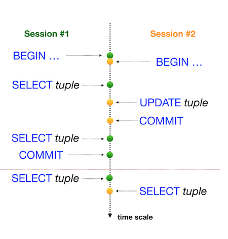

# Day 08 - Piscine SQL

## _Isolation is one of ACID properties_

Resume: Today you will see how database works with transactions and isolation levels.
> Пожалуйста, используйте командную строку для базы данных PostgreSQL (psql) для этой задачи. Вам необходимо проверить, как ваши изменения будут опубликованы в базе данных для других пользователей базы данных.
На самом деле нам нужны два активных сеанса (т.е. 2 параллельных сеанса в командной строке).

  Preamble 

Лестница Пенроуза или ступени Пенроуза, также называемая невозможной лестницей, — невозможный объект, созданный Лайонелом Пенроузом и его сыном Роджером Пенроузом. Разновидность треугольника Пенроуза, это двумерное представление лестницы, в которой ступени делают четыре поворота на 90 градусов по мере подъема или спуска, но при этом образуют непрерывную петлю, так что человек может подниматься по ним вечно и никогда не подниматься выше. Это явно невозможно в трех измерениях. «Непрерывная лестница» была впервые представлена ​​в статье, написанной Пенроузами в 1959 году, на основе так называемого «треугольника Пенроуза», опубликованного Роджером Пенроузом в British Journal of Psychology в 1958 году.
«Лестница Пенроуза» — это математическая аномалия, на самом деле теория баз данных имеет 4 фундаментальные аномалии данных (физические аномалии).

Аномалия потерянного обновления;
Аномалия грязных показаний;
Аномалия неповторяющихся показаний;
Аномалия фантомного чтения.

Поэтому в стандарте ANSI SQL предусмотрены различные уровни изоляции, которые предотвращают известные аномалии.

С одной точки зрения, эта матрица должна быть стандартом для любой реляционной базы данных, но реальность... выглядит немного иначе.

|  |  | |
| ------ | ------ | ------ |
| PostgreSQL |  |
| Oracle |  |
| MySQL |  |

В настоящее время ИТ-сообщество обнаружило ряд новых аномалий, основанных на модели базы данных (логическое представление):

Прочитайте Аномалию перекоса;
Запись аномалии перекоса;
Аномалия сериализации;
Аномалия «Веерные ловушки»;
Аномалия «Пропасть ловушек»;
Аномалия циклов модели данных;
и т. д.

  Exercise 00 - Simple transaction 

| Exercise 00: Simple transaction |                                                                                                                          |
|---------------------------------------|--------------------------------------------------------------------------------------------------------------------------|
| Turn-in directory                     | ex00                                                                                                                     |
| Files to turn-in                      | `day08_ex00.sql` with comments for Session #1, Session #2 statements; screenshot of psql output for Session #1; screenshot of psql output for Session #2 |
| **Allowed**                               |                                                                                                                          |
| Language                        |  SQL|

Предоставьте доказательство того, что ваш параллельный сеанс не сможет увидеть ваши изменения, пока вы не сделаете COMMIT;
См. шаги ниже.
**Session #1**

Обновление рейтинга «Pizza Hut» до 5 баллов в транзакционном режиме.
Проверьте, видны ли изменения в session #1.

**Session #2**

Убедитесь, что вы не видите изменений в session #2.

**Session #1**

Опубликуйте свои изменения для всех параллельных сеансов.

**Session #2**

Проверьте, видны ли изменения в session #2.

Итак, взгляните на пример нашего вывода для сеанса №2.

    pizza_db=> select * from pizzeria where name  = 'Pizza Hut';
    id |   name    | rating
    ----+-----------+--------
    1 | Pizza Hut |    4.6
    (1 row)

    pizza_db=> select * from pizzeria where name  = 'Pizza Hut';
    id |   name    | rating
    ----+-----------+--------
    1 | Pizza Hut |      5
    (1 row)

Вы можете видеть, что один и тот же запрос возвращает разные результаты, поскольку первый запрос был выполнен до публикации в session #1, а второй запрос был выполнен после завершения сеанса №1.

**== скриншот выполнения == **

 Exercise 01 - Lost Update Anomaly 

| Exercise 01: Lost Update Anomaly|                                                                                                                          |
|---------------------------------------|--------------------------------------------------------------------------------------------------------------------------|
| Turn-in directory                     | ex01                                                                                                                     |
| Files to turn-in                      | `day08_ex01.sql` with comments for Session #1, Session #2 statements; screenshot of psql output for Session #1; screenshot of psql output for Session #2                                                                                 |
| **Allowed**                               |                                                                                                                          |
| Language                        |  SQL                                                                                              |

Перед запуском задачи убедитесь, что вы находитесь на стандартном уровне изоляции в своей базе данных. Просто запустите следующий оператор SHOW TRANSACTION ISOLATION LEVEL;, и результатом должно быть "read commited".
Если нет, установите уровень изоляции read commited явно на уровне сеанса.

    
|  |  |
| ------ | ------ |
| Давайте рассмотрим один из известных шаблонов базы данных "Lost Update Anomaly", но под REPEATABLE READуровнем изоляции. Графическое представление этой аномалии вы можете увидеть на рисунке. Горизонтальная красная линия означает окончательные результаты после всех последовательных шагов для обоих сеансов.  |
 |  |
 |  | 
|     

Проверьте рейтинг «Pizza Hut» в режиме транзакции для обоих сеансов, а затем измените UPDATEрейтинг на значение 4 в сеансе № 1 и измените UPDATEрейтинг на значение 3,6 в сеансе № 2 (в том же порядке, что и на рисунке).

**== скриншот выполнения == **

  Exercise 02 - Lost Update for Repeatable Read (Потерянное обновление для повторяющегося чтения)

| Exercise 02: Lost Update for Repeatable Read|                                                                                                                          |
|---------------------------------------|--------------------------------------------------------------------------------------------------------------------------|
| Turn-in directory                     | ex02                                                                                                                     |
| Files to turn-in                      | `day08_ex02.sql` with comments for Session #1, Session #2 statements; screenshot of psql output for Session #1; screenshot of psql output for Session #2                                                                                  |
| **Allowed**                               |                                                                                                                          |
| Language                        |  SQL                                                                                              |

|  |  |
| ------ | ------ |
| Давайте рассмотрим один из известных шаблонов базы данных `"Lost Update Anomaly"`, но под `REPEATABLE READ` уровнем изоляции. Графическое представление этой аномалии вы можете увидеть на рисунке. Горизонтальная красная линия означает окончательные результаты после всех последовательных шагов для обоих сеансов.|  |
|   | |

Please check a rating for "Pizza Hut" in a transaction mode for both sessions and then make an `UPDATE` of the rating to a value of 4 in Session #1 and make an `UPDATE` of the rating to a value of 3.6 in Session #2 (in the same order as in the picture).

**== скриншот выполнения == **

 Exercise 03 - Non-Repeatable Reads Anomaly (Аномалия неповторяющихся чтений)

| Exercise 03: Non-Repeatable Reads Anomaly |                                                                                                                          |
|---------------------------------------|--------------------------------------------------------------------------------------------------------------------------|
| Turn-in directory                     | ex03                                                                                                                     |
| Files to turn-in                      | `day08_ex03.sql` with comments for Session #1, Session #2 statements; screenshot of psql output for Session #1; screenshot of psql output for Session #2                                                                                 |
| **Allowed**                               |                                                                                                                          |
| Language                        |  SQL                                                                                              |

|  |  |
| ------ | ------ |
|Давайте проверим один из известных шаблонов базы данных `"Non-Repeatable Reads"`, но под `READ COMMITTED` уровнем изоляции. Графическое представление этой аномалии вы можете увидеть на рисунке. Горизонтальная красная линия представляет собой конечный результат после всех последовательных шагов для обоих сеансов.|  |
|   | |

Проверьте рейтинг «Pizza Hut» в режиме транзакции для сеанса №1, а затем измените UPDATEрейтинг до значения 3,6 в session #2 (в том же порядке, что и на рисунке).

**== скриншот выполнения == **

 Exercise 04 - Non-Repeatable Reads for Serialization (Неповторяющиеся чтения для сериализации)

| Exercise 04: Non-Repeatable Reads for Serialization |                                                                                                                          |
|---------------------------------------|--------------------------------------------------------------------------------------------------------------------------|
| Turn-in directory                     | ex04                                                                                                                     |
| Files to turn-in                      | `day08_ex04.sql` with comments for Session #1, Session #2 statements; screenshot of psql output for Session #1; screenshot of psql output for Session #2                                                                                 |
| **Allowed**                               |                                                                                                                          |
| Language                        |  SQL                                                                                              |

|  |  |
| ------ | ------ |
| Давайте проверим один из известных шаблонов базы данных `"Non-Repeatable Reads"`, но под `SERIALIZABLE` уровнем изоляции. Графическое представление этой аномалии вы можете увидеть на рисунке. Горизонтальная красная линия представляет собой окончательные результаты после всех последовательных шагов для обоих сеансов. |  |
|   | |

Проверьте рейтинг «Pizza Hut» в режиме транзакции для сеанса №1, а затем измените UPDATEрейтинг до значения 3,0 в session #2 (в том же порядке, что и на рисунке).

**== скриншот выполнения == **

 Exercise 05 - Phantom Reads Anomaly

| Exercise 05: Phantom Reads Anomaly|                                                                                                                          |
|---------------------------------------|--------------------------------------------------------------------------------------------------------------------------|
| Turn-in directory                     | ex05                                                                                                                     |
| Files to turn-in                      | `day08_ex05.sql`  with comments for Session #1, Session #2 statements; screenshot of psql output for Session #1; screenshot of psql output for Session #2                                                                                 |
| **Allowed**                               |                                                                                                                          |
| Language                        |   SQL                                                                                              |
0

|  |  |
| ------ | ------ |
| Давайте проверим один из известных шаблонов базы данных "фантомных чтений", но под READ COMMITTEDуровнем изоляции. Графическое представление этой аномалии вы можете увидеть на рисунке. Горизонтальная красная линия представляет собой окончательные результаты после всех последовательных шагов для обоих сеансов.|  |
|   | |

Пожалуйста, суммируйте все рейтинги для всех пиццерий в одном транзакционном режиме для сеанса №1, а затем создайте INSERTновый ресторан «Казань Пицца» с рейтингом 5 и ID=10 в session #2 (в том же порядке, что и на рисунке).

 **== скриншот выполнения == **

 Exercise 06 - Phantom Reads for Repeatable Read 

| Exercise 06: Phantom Reads for Repeatable Read|                                                                                                                          |
|---------------------------------------|--------------------------------------------------------------------------------------------------------------------------|
| Turn-in directory                     | ex06                                                                                                                     |
| Files to turn-in                      | `day08_ex06.sql`  with comments for Session #1, Session #2 statements; screenshot of psql output for Session #1; screenshot of psql output for Session #2                                                                                 |
| **Allowed**                               |                                                                                                                          |
| Language                        |  SQL                                                                                              |

|  |  |
| ------ | ------ |
| Давайте проверим один из известных шаблонов базы данных "Phantom Reads", но под уровнем изоляции REPEATABLE READ. Графическое представление этой аномалии вы можете увидеть на рисунке. Горизонтальная красная линия представляет собой окончательные результаты после всех последовательных шагов для обоих сеансов. |  |
| |  |

Пожалуйста, суммируйте все рейтинги всех пиццерий в одном транзакционном режиме для сеанса №1, а затем создайте INSERTновый ресторан «Казань Пицца 2» с рейтингом 4 и ID=11 в session #2 (в том же порядке, что и на рисунке).

**== скриншот выполнения == **

  Exercise 07 - Deadlock 

| Exercise 07: Deadlock|                                                                                                                          |
|---------------------------------------|--------------------------------------------------------------------------------------------------------------------------|
| Turn-in directory                     | ex07                                                                                                                     |
| Files to turn-in                      | `day08_ex07.sql`    with comments for Session #1, Session #2 statements; screenshot of psql output for Session #1; screenshot of psql output for Session #2                                                                                |
| **Allowed**                               |                                                                                                                          |
| Language                        |  SQL                                                                                              |

Let’s reproduce a deadlock situation in our database. 

|  |  |
| ------ | ------- |
| Графическое представление тупиковой ситуации можно увидеть на рисунке. Это похоже на «Christ-lock» между параллельными сессиями.  |                       _                 |
  |        |              _                     |
  
 

Пожалуйста, напишите любой оператор SQL с любым уровнем изоляции (можно использовать настройку по умолчанию) в таблице, pizzeriaчтобы воспроизвести эту ситуацию взаимоблокировки.

**== скриншот выполнения == **

[D08_Exercise 01, 02, 03, 04, 05, 06, 07 ](src/day08.sql)
